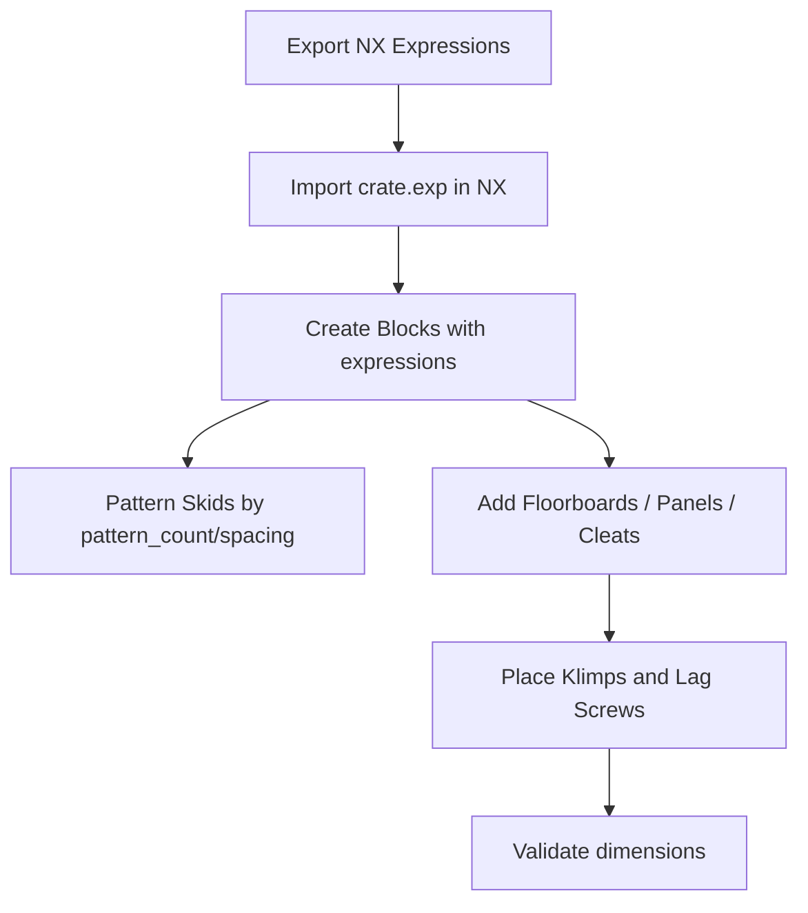
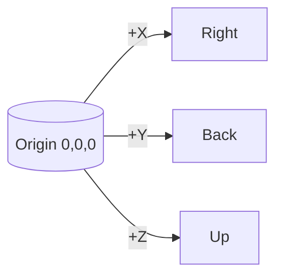
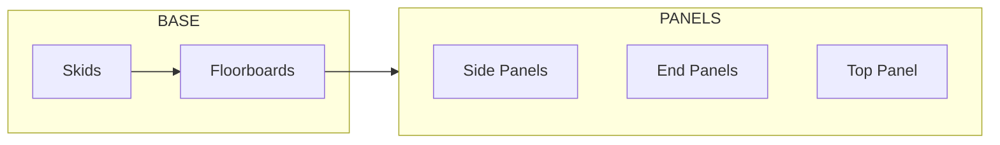

# NX: Recreate Crate Geometry

Step-by-step instructions to build the AutoCrate model in Siemens NX using the two‑diagonal‑points method and exported expressions.



## Prerequisites

- Siemens NX 12.0 or newer
- Units: Inches
- Coordinate system: Origin at crate center bottom (X=0, Y=0, Z=0)

## 1) Get NX Expressions

Option A — From the app UI:

- On the main page, click “Export NX” to generate the expressions and copy to a file named `crate.exp`.

Option B — From the API:

```
POST /api/nx-export
{
  "dimensions": { "length": 48, "width": 32, "height": 36 },
  "weight": 1200,
  "exportFormat": "expressions",
  "units": "inch"
}
```

Save the returned `export.content` as `crate.exp`.

## 2) Import in NX

1. File → New → Model. Set units to Inches.
2. Tools → Expressions → Import… → select `crate.exp`.
3. Verify expressions such as `overall_width/length/height`, `pattern_count`, `pattern_spacing`, and per‑piece parameters (e.g., `FLOORBOARD_1_X1`, `SIDE_PANEL_X`, etc.).

## 3) Datum & Axes

- XY (Primary) at Z=0 (bottom)
- YZ (Secondary) at X=0 (center plane)
- XZ (Tertiary) at Y=0 (front plane)

## 4) Create Geometry (Two Diagonal Points)

Use Insert → Design Feature → Block → Type: Opposite Corners. Enter expressions directly instead of numbers.

- Generic boxes (e.g., `SKID`, `FLOORBOARD_*`):
  - Corner 1: `NAME_X1`, `NAME_Y1`, `NAME_Z1`
  - Corner 2: `NAME_X2`, `NAME_Y2`, `NAME_Z2`

- Plywood panels:
  - Corner: `NAME_X`, `NAME_Y`, `NAME_Z`
  - Extents: `NAME_WIDTH`, `NAME_LENGTH`, `NAME_HEIGHT`
  - Thickness: `NAME_THICKNESS` (if present)

- Cleats:
  - Same 7 parameters as panels; thickness is `0.750` (actual 1×4)

### 4.1 Skids

1. Create one `SKID` Block from `SKID_X1..Z1` and `SKID_X2..Z2`.
2. Pattern (direction X): Count = `pattern_count`, Spacing = `pattern_spacing` (center‑to‑center).

### 4.2 Floorboards

- Create Blocks for each `FLOORBOARD_n` using their `_X1.._Z1` and `_X2.._Z2` expressions.
- If a board is exported as suppressed, suppress or omit the corresponding feature.

### 4.3 Panels (Plywood)

```
Corner:    NAME_X, NAME_Y, NAME_Z
Extents:   NAME_WIDTH, NAME_LENGTH
Thickness: NAME_THICKNESS (or NAME_HEIGHT when provided)
```

### 4.4 Cleats

- Use the 7 parameters; thickness fixed at `0.750`.

### 4.5 Klimp Fasteners

1. Import `CAD FILES/Crate Spring Clamp.STEP` once.
2. For each `KLIMP_n` with `KLIMP_n_ACTIVE=TRUE`, place at `KLIMP_n_POS_X/Y/Z` and rotate using `KLIMP_n_ROT_X/Y/Z`.

### 4.6 Lag Screws

- Import `CAD FILES/LAG SCREW_0.38 X 2.50.stp`.
- Place under intermediate vertical cleats; use `lag_screw_count` as quantity guidance.

## 5) Validation Checklist

- Overall dimensions match `overall_width/length/height`.
- Skid count and spacing match `pattern_count` and `pattern_spacing`.
- Panels and cleats align; clearances are respected.
- Klimp instances only where `_ACTIVE=TRUE`.

## Tips

- Always reference expressions in dialogs; avoid hard‑typed numbers.
- Use feature suppression to reflect `_SUPPRESSED` flags.
- Keep origin/axes consistent with the export header for predictable placement.
## Reference Diagrams





